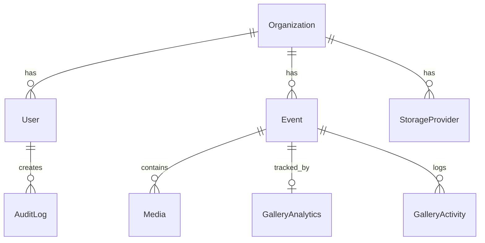

# Audit — Prisma & Database

## Issues Found

### 🔴 Critical

#### 1. Access PIN stored in plaintext — timing-safe comparison absent
- **File:** `prisma/schema.prisma` (line 67) / `src/services/gallery.ts` (line 84)
- **Issue:** The `accessPin` field on the `Event` model is stored as a plaintext `String?`. The verification in `GalleryService.verifyAccessCode()` uses a direct `===` comparison (`event.accessPin === pin.trim()`), which is vulnerable to timing attacks and exposes the raw PIN if the database is ever compromised.
- **Impact:** An attacker with read access to the database (SQL injection, backup leak, admin panel exposure) can see every event's PIN. Timing attacks could allow brute-forcing PINs over the network.
- **Fix:**
```ts
// prisma/schema.prisma — no schema change needed, store a hash instead

// src/services/gallery.ts
import bcrypt from 'bcryptjs';

static async verifyAccessCode(slug: string, pin: string): Promise<boolean> {
  const event = await prisma.event.findFirst({ where: { slug } });
  if (!event) return false;
  if (event.accessMode !== AccessMode.ACCESS_CODE) return true;
  if (!event.accessPin) return false;
  // Compare hashed PIN
  return bcrypt.compare(pin.trim(), event.accessPin);
}

// src/actions/event.ts — hash the PIN before saving
import bcrypt from 'bcryptjs';
// In createEventAction / updateEventAction:
accessPin: data.accessMode === 'ACCESS_CODE' && data.accessPin
  ? await bcrypt.hash(data.accessPin, 10)
  : null,
```

---

#### 2. `StorageProvider` model stores credentials as plaintext `String`
- **File:** `prisma/schema.prisma` (line 125)
- **Issue:** The `credentials` field on `StorageProvider` is a plain `String`. This means API keys, secret keys, and tokens for cloud storage providers (S3, R2, GDrive, etc.) are stored in the database as unencrypted text.
- **Impact:** Any database breach exposes all third-party storage credentials, enabling full access to customer media files across all storage providers.
- **Fix:**
```prisma
model StorageProvider {
  id             String       @id @default(uuid())
  name           String
  type           String
  credentialsEnc String       // Encrypted at the application layer (AES-256-GCM)
  credentialsIv  String       // Initialization vector for decryption
  isDefault      Boolean      @default(false)
  organizationId String
  organization   Organization @relation(fields: [organizationId], references: [id], onDelete: Cascade)
  createdAt      DateTime     @default(now())
  updatedAt      DateTime     @updatedAt

  @@index([organizationId])
}
```
Encrypt/decrypt credentials in the application layer using a `CREDENTIALS_ENCRYPTION_KEY` env var.

---

#### 3. `createEventAction` bypasses authentication — falls back to first organization
- **File:** `src/actions/event.ts` (lines 18–27)
- **Issue:** When `session?.user?.organizationId` is `null`, the action falls back to `db.organization.findFirst()` instead of rejecting the request. This means an unauthenticated or improperly-configured user can create events under any organization.
- **Impact:** Unauthorized event creation. Any user without an `organizationId` (or if the session is somehow present but malformed) can create events under the first organization in the database.
- **Fix:**
```ts
export async function createEventAction(
  formData: EventFormData
): Promise<{ success: boolean; slug?: string; errors?: Record<string, string[]> }> {
  const session = await auth();
  if (!session?.user?.organizationId) {
    return { success: false, errors: { global: ['Unauthorized. Please log in.'] } };
  }
  const organizationId = session.user.organizationId;
  // ... rest of function
}
```

---

#### 4. No migration files — schema may not be reproducible
- **File:** `prisma/` (directory)
- **Issue:** The `prisma/migrations/` directory does not exist. The project appears to use `prisma db push` exclusively (confirmed by `package.json` script `"db:push": "prisma db push"`). There is no migration history, meaning schema changes are not tracked, cannot be rolled back, and are not auditable.
- **Impact:** In production, `db push` can cause data loss (it may drop columns/tables to reconcile schema). Without migrations, there is no deployment safety net, no rollback capability, and no audit trail of schema changes.
- **Fix:**
```bash
# Switch to migration-based workflow
npx prisma migrate dev --name init  # Generate initial migration from current schema
# Replace db:push script in package.json:
"db:migrate": "prisma migrate deploy"
# Use in CI/CD:
"build": "prisma generate && prisma migrate deploy && next build"
```

---

### 🟠 High

#### 5. N+1 query pattern — sequential `StorageService.deleteFile()` calls in loops
- **File:** `src/actions/event.ts` (lines 222–226)
- **Issue:** `deleteEventAction` iterates over `event.media` and calls `StorageService.deleteFile()` sequentially in a `for...of` loop. For events with hundreds of media items, this creates hundreds of sequential I/O operations.
- **Impact:** Extremely slow event deletion for large galleries. Each delete is a network round-trip (to Supabase Storage). An event with 500 photos takes ~500 sequential API calls.
- **Fix:**
```ts
// Parallelize file deletions with concurrency limit
const BATCH_SIZE = 10;
const mediaUrls = event.media.map(m => m.url);
if (event.coverImageUrl) mediaUrls.push(event.coverImageUrl);
if (event.coverVideoUrl) mediaUrls.push(event.coverVideoUrl);

for (let i = 0; i < mediaUrls.length; i += BATCH_SIZE) {
  const batch = mediaUrls.slice(i, i + BATCH_SIZE);
  await Promise.allSettled(batch.map(url => StorageService.deleteFile(url)));
}
```

---

#### 6. N+1 pattern in `bulkDeleteMediaAction` — sequential storage deletes
- **File:** `src/actions/media.ts` (lines 58–61)
- **Issue:** Same pattern as above — `for (const item of items)` with `await StorageService.deleteFile()` inside the loop. This is a sequential N+1 I/O pattern.
- **Impact:** Bulk delete of 100 files = 100+ sequential network calls. UI will appear to hang.
- **Fix:**
```ts
await Promise.allSettled(
  items.flatMap(item => {
    const ops = [StorageService.deleteFile(item.url)];
    if (item.thumbnailUrl) ops.push(StorageService.deleteFile(item.thumbnailUrl));
    return ops;
  })
);
```

---

#### 7. N+1 pattern in cron cleanup — nested sequential loops with DB writes
- **File:** `src/app/api/cron/cleanup/route.ts` (lines 52–76)
- **Issue:** The cron handler loops over expired events, and for each event loops over its media to delete files sequentially. Then it runs a `db.event.update()` for each event individually instead of batching.
- **Impact:** If 50 events expire with 100 media each, the cron job executes ~5,000 sequential storage deletes + 50 sequential DB updates. This could easily time out Vercel's serverless function limit (10s default, 60s max).
- **Fix:**
```ts
// Batch the DB updates and parallelize storage deletes
for (const event of expiredEvents) {
  // Parallelize media deletion per event
  await Promise.allSettled(
    event.media.map(media => StorageService.deleteFile(media.fileKey))
  );
  results.filesDeleted += event.media.length;
}

// Batch archive all expired events in one query
await db.event.updateMany({
  where: { id: { in: expiredEvents.map(e => e.id) } },
  data: { isArchived: true, status: 'ARCHIVED' },
});
results.eventsArchived = expiredEvents.length;
```

---

#### 8. `getAdminEventList()` has no organization scoping by default
- **File:** `src/services/admin.ts` (lines 15–24)
- **Issue:** `getAdminEventList(organizationId?)` accepts an optional `organizationId`. When called without it (as on the events page: `getAdminEventList()` with no argument), the `where` clause becomes `undefined`, returning **all events across all organizations**.
- **Impact:** In a multi-tenant setup, one admin could see events belonging to other organizations. Currently mitigated by single-tenant usage, but the code architecture allows this to break silently.
- **Fix:**
```ts
// src/app/admin/dashboard/events/page.tsx
import { auth } from '@/../auth';

export default async function EventsPage() {
  const session = await auth();
  const events = await getAdminEventList(session?.user?.organizationId ?? undefined);
  // ...
}

// Do the same for getDashboardMetrics() and getAnalyticsOverview()
```

---

#### 9. Media library page fetches ALL media across all organizations
- **File:** `src/app/admin/dashboard/media/page.tsx` (lines 6–9)
- **Issue:** `prisma.media.findMany({...})` has no `where` clause filtering by organization. It returns every media record in the database.
- **Impact:** In multi-tenant, admins see other organizations' media. Even in single-tenant, this query will become increasingly slow as the media table grows (no pagination).
- **Fix:**
```ts
export default async function MediaLibraryPage() {
  const session = await auth();
  if (!session?.user?.organizationId) redirect('/admin');

  const media = await prisma.media.findMany({
    where: { event: { organizationId: session.user.organizationId } },
    include: { event: { select: { title: true, slug: true } } },
    orderBy: { createdAt: 'desc' },
    take: 200, // Add pagination
  });
  // ...
}
```

---

#### 10. `getStorageUsageAction` queries `storage.objects` — Prisma cannot access Supabase internal schema
- **File:** `src/actions/media.ts` (lines 83–88)
- **Issue:** The raw query `SELECT SUM(...) FROM storage.objects WHERE bucket_id = 'gallery-media'` attempts to query Supabase's internal `storage` schema. However, the `DATABASE_URL` in `.env` points to a **Neon** PostgreSQL database (not Supabase PostgreSQL), so the `storage.objects` table does not exist. The fallback works, but the primary query path will always fail.
- **Impact:** Every call to `getStorageUsageAction` triggers a caught error + console warning. Wastes a DB round-trip and clutters logs.
- **Fix:**
```ts
export async function getStorageUsageAction() {
  try {
    // Use Media table aggregate directly — works regardless of storage provider
    const aggregate = await db.media.aggregate({
      _sum: { sizeBytes: true },
    });
    const totalBytes = aggregate._sum.sizeBytes || 0;

    const limitGb = process.env.STORAGE_LIMIT_GB ? parseFloat(process.env.STORAGE_LIMIT_GB) : 1;
    const planLimitBytes = limitGb * 1024 * 1024 * 1024;
    const isSupabase = process.env.STORAGE_PROVIDER === 'SUPABASE';

    return {
      usedBytes: totalBytes,
      planLimitBytes,
      providerName: isSupabase ? 'Supabase Storage' : 'Local Storage',
    };
  } catch (err) {
    // ...
  }
}
```

---

### 🟡 Medium

#### 11. `StorageProvider` model is completely unused in application code
- **File:** `prisma/schema.prisma` (lines 121–133)
- **Issue:** The `StorageProvider` model exists in the schema with fields (`name`, `type`, `credentials`, `isDefault`, `organizationId`), but no application code ever queries, creates, updates, or deletes records from this table. Storage provider selection is entirely handled via the `STORAGE_PROVIDER` environment variable.
- **Impact:** Dead schema — creates an unnecessary table in production, consumes storage, and introduces a maintenance burden. The `credentials` field (see Critical #2) is a security liability for a table that is never used.
- **Fix:** Either remove the model from the schema, or implement the DB-driven storage provider feature. If removing:
```diff
// prisma/schema.prisma — Remove the StorageProvider model entirely
- model StorageProvider {
-   id             String       @id @default(uuid())
-   name           String
-   type           String
-   credentials    String
-   isDefault      Boolean      @default(false)
-   organizationId String
-   organization   Organization @relation(fields: [organizationId], references: [id], onDelete: Cascade)
-   createdAt      DateTime     @default(now())
-   updatedAt      DateTime     @updatedAt
-   @@index([organizationId])
- }

// Also remove from Organization model:
-   storageProviders StorageProvider[]
```

---

#### 12. `GalleryActivity.metadata` stored as `String?` — should be `Json?`
- **File:** `prisma/schema.prisma` (line 153)
- **Issue:** The `metadata` field on `GalleryActivity` is a `String?`. The application code stores JSON in this field via `JSON.stringify({ source })` (see `gallery.ts` line 34). Using `String` means no JSON query operators, no type safety, and manual serialization/deserialization.
- **Impact:** Cannot query or filter activities by metadata properties. Extra `JSON.parse()` calls needed everywhere. No database-level validation of JSON structure.
- **Fix:**
```prisma
model GalleryActivity {
  // ...
  metadata  Json?    // PostgreSQL native JSON type — queryable and type-safe
  // ...
}
```

---

#### 13. Prisma `enum` types not used — string fields with no DB-level constraint
- **File:** `prisma/schema.prisma` (lines 16, 62–63, 68–69, 111, 124, 150)
- **Issue:** Fields like `role`, `accessMode`, `status`, `type`, `category`, and `theme` are all plain `String` types in the schema. The application uses TypeScript enums in `src/types/enums.ts`, but there is no database-level constraint. Any arbitrary string can be inserted.
- **Impact:** Data integrity risk — a bug in application code could insert `"INVALID_STATUS"` or `""` into these fields. No DB-level validation exists.
- **Fix:**
```prisma
enum UserRole {
  SUPER_ADMIN
  ADMIN
  ORGANIZER
  VIEWER
}

enum AccessMode {
  PUBLIC
  ACCESS_CODE
  QR_ONLY
}

enum EventStatus {
  DRAFT
  PUBLISHED
  ARCHIVED
}

enum MediaType {
  PHOTO
  VIDEO
}

model User {
  // ...
  role  UserRole @default(ADMIN)
}

model Event {
  // ...
  accessMode AccessMode @default(PUBLIC)
  status     EventStatus @default(DRAFT)
}

model Media {
  // ...
  type MediaType
}
```

---

#### 14. `Event.slug` has both `@unique` and `@@index([slug])` — redundant index
- **File:** `prisma/schema.prisma` (lines 57, 93)
- **Issue:** The `slug` field has `@unique` which automatically creates a unique index. The explicit `@@index([slug])` on line 93 creates a second, redundant non-unique index on the same column.
- **Impact:** Wasted storage and slightly slower writes (two indexes to maintain). No functional harm, but wasteful.
- **Fix:**
```diff
  // Remove the redundant index
  @@index([organizationId])
  @@index([status])
- @@index([slug])
```

---

#### 15. `GalleryActivity` table has no retention policy or size management
- **File:** `prisma/schema.prisma` (lines 146–159)
- **Issue:** The `GalleryActivity` model records every single gallery view, download, QR scan, and share. There is no `updatedAt` field, no archiving mechanism, and no TTL/cleanup. This is a write-heavy, append-only table.
- **Impact:** Unbounded table growth. Over time, this table will become the largest in the database, degrading query performance. The cron cleanup job (`/api/cron/cleanup`) only handles expired events — it does not clean up old activity records.
- **Fix:** Add a cleanup step to the cron job:
```ts
// In /api/cron/cleanup/route.ts — add activity retention cleanup
const retentionDays = 90;
const cutoff = new Date(Date.now() - retentionDays * 24 * 60 * 60 * 1000);
await db.galleryActivity.deleteMany({
  where: { createdAt: { lt: cutoff } },
});
```

---

#### 16. `AuditLog` model exists but is never written to
- **File:** `prisma/schema.prisma` (lines 161–176)
- **Issue:** The `AuditLog` model is defined with fields for `action`, `entity`, `entityId`, `details`, and `ipAddress`, but no application code ever creates audit log entries. None of the server actions or API routes write to this table.
- **Impact:** The audit trail feature is defined but unimplemented. In a production system handling sensitive media, there is no record of who created/edited/deleted events or media.
- **Fix:** Create an audit logging utility and call it from critical actions:
```ts
// src/services/audit.ts
import { db } from '@/database/db';

export async function createAuditLog(params: {
  userId?: string;
  action: string;
  entity: string;
  entityId?: string;
  details?: string;
  ipAddress?: string;
}) {
  await db.auditLog.create({ data: params });
}

// Usage in actions/event.ts:
await createAuditLog({
  userId: session.user.id,
  action: 'DELETE',
  entity: 'Event',
  entityId: id,
  details: `Deleted event "${event.title}"`,
});
```

---

#### 17. `unstable_cache` imported but never used in branding service
- **File:** `src/services/branding.ts` (line 2)
- **Issue:** `import { unstable_cache } from 'next/cache'` is imported but never used. The `getBranding()` function queries the database on every single request (including every page load via the root layout).
- **Impact:** Every page render triggers a database query for branding data that rarely changes. This adds latency and unnecessary database load.
- **Fix:**
```ts
import { unstable_cache } from 'next/cache';
import { db } from '@/database/db';

export const getBranding = unstable_cache(
  async () => {
    try {
      const org = await db.organization.findFirst();
      if (!org) return null;
      return {
        businessName: org.name,
        logoUrl: org.logoUrl,
        // ... rest of fields
      };
    } catch (error) {
      console.error('Failed to load branding:', error);
      return null;
    }
  },
  ['branding'],
  { revalidate: 300, tags: ['branding'] } // Cache for 5 minutes
);
```

---

#### 18. `Event.tags` should be a relation or array, not a single `String?`
- **File:** `prisma/schema.prisma` (line 76)
- **Issue:** Tags are stored as a single `String?` field. This means tags are likely comma-separated or similar, making it impossible to efficiently query events by tag, count tag usage, or enforce tag uniqueness.
- **Impact:** No index on tags content, no SQL `WHERE tag IN (...)` queries possible, full-text search required for tag filtering.
- **Fix:** For simplicity, use PostgreSQL array:
```prisma
model Event {
  // ...
  tags  String[]  // PostgreSQL text array — supports @> contains operator
  // ...
}
```

---

### 🟢 Low

#### 19. Prisma Client singleton pattern is correct but missing `$disconnect` handler
- **File:** `src/database/db.ts` (lines 1–14)
- **Issue:** The global singleton pattern for PrismaClient is correctly implemented for hot-reload safety. However, there is no graceful shutdown handler to call `prisma.$disconnect()` on process termination.
- **Impact:** In long-running serverless environments, connection pool exhaustion is possible. In development, dangling connections may accumulate on HMR restarts.
- **Fix:**
```ts
import { PrismaClient } from '@prisma/client';

const globalForPrisma = globalThis as unknown as {
  prisma: PrismaClient | undefined;
};

export const db =
  globalForPrisma.prisma ??
  new PrismaClient({
    log: process.env.NODE_ENV === 'development' ? ['query', 'error', 'warn'] : ['error'],
  });

if (process.env.NODE_ENV !== 'production') globalForPrisma.prisma = db;

// Graceful shutdown
process.on('beforeExit', async () => {
  await db.$disconnect();
});
```

---

#### 20. `User.role` defaults to `"ADMIN"` — new users are admins by default
- **File:** `prisma/schema.prisma` (line 16)
- **Issue:** The `role` field defaults to `@default("ADMIN")`. If user creation is ever exposed beyond the seed script (e.g., a future registration feature), every new user would be an admin.
- **Impact:** Low risk currently (user creation is only in the seed script), but a ticking time bomb if user registration is added.
- **Fix:**
```prisma
role  String  @default("VIEWER")  // Or use enum: UserRole @default(VIEWER)
```

---

#### 21. `Media.sizeBytes` is `Int?` — will overflow for large video files
- **File:** `prisma/schema.prisma` (line 107)
- **Issue:** `sizeBytes` is an optional `Int` (32-bit signed). The maximum value is ~2.14 GB. The upload route allows videos up to 100 MB, but if limits change or the field is used for aggregate calculations, `Int` will overflow.
- **Impact:** Low risk at current 100 MB limit, but `BigInt` is the correct type for byte sizes in a production system.
- **Fix:**
```prisma
sizeBytes  BigInt?   // Supports files up to 9.2 exabytes
```

---

#### 22. `Organization` model has no `@@index` — will be slow with many organizations
- **File:** `prisma/schema.prisma` (lines 27–52)
- **Issue:** The `Organization` model has unique indexes on `slug` and `customDomain`, but no additional indexes. The `name` field (used in searches/display) has no index.
- **Impact:** Negligible in single-tenant, but if multi-tenant scaling is planned, lookups by name will be full table scans.
- **Fix:**
```prisma
model Organization {
  // ...
  @@index([name])
}
```

---

#### 23. `PrismaAdapter` used with JWT strategy — adapter is partially redundant
- **File:** `auth.ts` (lines 3, 9–10)
- **Issue:** `PrismaAdapter(db)` is configured alongside `session: { strategy: 'jwt' }`. When using the JWT strategy with Credentials provider, the PrismaAdapter creates `Account`, `Session`, and `VerificationToken` tables that are never used (NextAuth only uses the adapter for OAuth providers and database sessions).
- **Impact:** The adapter may attempt to create tables that don't exist in the Prisma schema (no `Account`, `Session`, or `VerificationToken` models), potentially causing errors on certain NextAuth operations. No functional harm with Credentials + JWT, but it's misleading configuration.
- **Fix:** Remove the adapter since you're using JWT-only with Credentials:
```ts
export const { handlers, auth, signIn, signOut } = NextAuth({
  // adapter: PrismaAdapter(db),  // Not needed for JWT + Credentials
  session: { strategy: 'jwt' },
  // ...
});
```

---

#### 24. `AuthService` class is a dead-code placeholder
- **File:** `src/services/auth.ts` (lines 1–26)
- **Issue:** The `AuthService` class contains two methods that return hardcoded values: `verifySessionToken()` always returns a fixed admin user, and `validateAdminCredentials()` always returns `true`. This class is never imported or used anywhere in the application.
- **Impact:** Dead code. If accidentally imported, it would bypass all authentication.
- **Fix:** Delete `src/services/auth.ts` entirely. Authentication is correctly handled via NextAuth in `auth.ts`.

---

#### 25. Dashboard page calls `getAdminEventList()` redundantly
- **File:** `src/app/admin/dashboard/page.tsx` (lines 16–20)
- **Issue:** The dashboard page calls three functions in parallel: `getDashboardMetrics()`, `getAnalyticsOverview()`, and `getAdminEventList()`. However, `getDashboardMetrics()` already counts events, and `getAdminEventList()` fetches the full event list with all media counts just to `.slice(0, 5)`. This is wasteful.
- **Impact:** Fetches all events with included relations when only 5 are needed.
- **Fix:**
```ts
// Create a dedicated function for recent events
export async function getRecentEvents(organizationId?: string, limit = 5) {
  return prisma.event.findMany({
    where: organizationId ? { organizationId } : undefined,
    include: {
      _count: { select: { media: true } },
      analytics: true,
    },
    orderBy: { createdAt: 'desc' },
    take: limit,
  });
}
```

---

## Summary

| Severity | Count |
|----------|-------|
| 🔴 Critical | 4 |
| 🟠 High | 6 |
| 🟡 Medium | 8 |
| 🟢 Low | 7 |
| **Total** | **25** |

---

## Priority Fix Order

1. **🔴 Remove `.env` from git history** — real database credentials and Supabase keys are committed (visible in `.env` lines 7–14). Rotate ALL keys immediately.
2. **🔴 Switch to migration-based workflow** (`prisma migrate`) before any production deployment.
3. **🔴 Fix `createEventAction` auth bypass** — remove the `findFirst()` fallback.
4. **🔴 Hash access PINs** before storing in the database.
5. **🟠 Add organization scoping** to `getAdminEventList()`, `getDashboardMetrics()`, `getAnalyticsOverview()`, and the media library page.
6. **🟠 Fix N+1 loops** in `deleteEventAction`, `bulkDeleteMediaAction`, and the cron cleanup.
7. **🟠 Remove the broken `storage.objects` raw query** in `getStorageUsageAction`.
8. **🟡 Remove or implement** the unused `StorageProvider` and `AuditLog` models.
9. **🟡 Switch string-typed enum fields** to Prisma enums for data integrity.
10. **🟡 Cache branding queries** using the already-imported `unstable_cache`.

---

## Schema Relationship Map



---

*Generated by Prisma & Database audit on 2026-07-30. Verify all findings against the live codebase before applying changes.*
